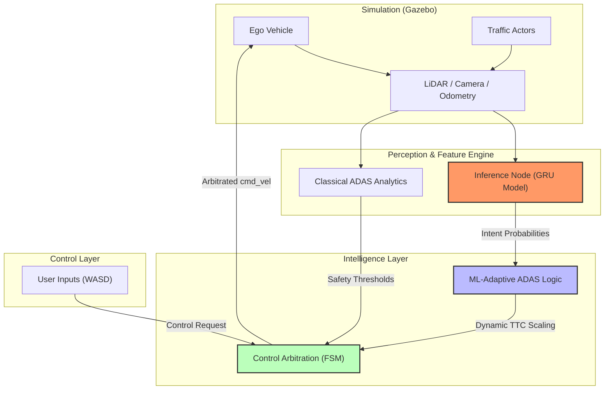

# Adaptive Intent-Aware ADAS (Advanced Driver Assistance System)

[](https://docs.ros.org/en/humble/index.html)
[](https://gazebosim.org/)
[](https://pytorch.org/)

A research-oriented ADAS framework that merges deterministic classical safety metrics with **Deep Temporal Intent Prediction**. This system minimizes "Nuisance Alerts" by dynamically modulating safety thresholds based on real-time classification of driver behavior and surrounding traffic patterns.

---

## 🏎️ 1. System Architecture

The project is built on a modular **ROS2 Humble** backend, designed for high-frequency control (20Hz) and real-time deep learning inference (10Hz).



---

## 🧠 2. Deep Intent classification (ML)

The system's core intelligence resides in the `inference_node.py`, which uses a sequence model to predict near-future behavior.

### � Feature Engineering (7-Dimensional Vector)
The model consumes a temporal window of 10 samples (1 second of state) across 7 critical features:

| Feature | Source | Rationale |
| :--- | :--- | :--- |
| **Yaw Rate** | IMU | Detects rapid directional changes / erratic swerving. |
| **Longitudinal Accel** | IMU/Odom | Captures aggressive throttle or "Late Braking" patterns. |
| **Steering Rate** | JointState | Distinguishes between gentle lane keeping and sharp evasion. |
| **Velocity Gradient** | Derived | Monitors acceleration/deceleration trends for TTC forecasting. |
| **Lane Deviation** | Odometry | Quantifies the distance from the target track centerline. |
| **Joint Effort** | JointState | Measures motor load/torque, indicating high-stress maneuvers. |
| **Proximity Range** | LiDAR | Ground truth distance to the closest frontal obstacle. |

### 🏗️ Model Architecture
- **Model Type**: 2-Layer Gated Recurrent Unit (GRU).
- **Sequence Length**: 10 samples (100ms interval).
- **Hidden Dim**: 64 units per layer.
- **Classification Classes**:
    1. `Aggressive`: High-speed tailgating/weaving.
    2. `Inconsistent`: Erratic steering/unstable lane keeping.
    3. `Late Braking`: High-deceleration approach to obstacles.
    4. `Defensive`: Stable, predictive driving (Baseline).

---

## 🛡️ 3. ML-Adaptive ADAS Logic

Unlike traditional systems with static thresholds, this logic dynamically shrinks or expands the safety envelope based on intent.

### 📉 The Dynamic TTC Equation
The safety threshold for Time-to-Collision ($TTC_{threshold}$) is modulated by the "Aggressive Intent" probability ($P_{intent}$):

$$TTC_{dynamic} = TTC_{base} \times (1.0 - \alpha \times P_{intent})$$

Where:
- **$\alpha$ (Sensitivity Factor)**: Scales the impact of the ML model on the safety system.
- **Result**: When $P_{intent}$ is high, the system becomes **proactively sensitive**, triggering warnings earlier to compensate for high-risk behavior.

### 👁️ Explainable AI (XAI)
The system publishes interactive explainability markers:
- **RViz Text Markers**: Real-time intent classification hover above vehicles.
- **Adaptive HUD**: Changes color grading based on safety state (Green ➔ Yellow ➔ Orange ➔ Red).

---

## 🚦 4. Safety Arbitration (FSM)

The `control_arbitration_node.py` manages the actual intervention using a **Hysteresis-Aware Finite State Machine**.

| State | Condition | Action |
| :--- | :--- | :--- |
| **MANUAL_ONLY** | $TTC > 4.0s$ | Full user control; soft Lane-Keep Assist (LKA) active. |
| **WARNING** | $TTC < 2.5s$ | Visual HUD alerts; user speed capped via software limit. |
| **ASSIST** | $TTC < 1.5s$ | Active evasion steering; autonomous speed reduction. |
| **EMERGENCY** | $TTC < 0.8s$ | **DEAD STOP**. Full safety override to prevent collision. |

> [!IMPORTANT]
> **Hysteresis Guard**: To prevent "State Flapping," the FSM enforces a `0.3s` cooldown before allowing de-escalation to a lower safety tier.

---

## 📊 5. Evaluation Framework

Each experiment generates a complete statistical report in `/evaluation`:
- **ROC Curves**: Comparison of True Positive Rate vs. False Positive Rate for Fixed vs ML modes.
- **Confusion Matrices**: Evaluating the accuracy of the Intent Classifier.
- **Safety Exposure**: Cumulative seconds spent in "Close Call" zones (<2.5m).

---

## � 6. Setup and Usage

### Build
```bash
cd ~/adas_ws
colcon build --symlink-install
source install/setup.bash
```

### Modes of Operation
- **Fixed ADAS (Classic)**: `./src/adas_project/scripts/auto_fixed.sh`
- **ML-Adaptive (Research)**: `./src/adas_project/scripts/auto_ml.sh`
- **Data Collection**: `ros2 run adas_project behavior_generator.py` (Records training data).

---
**Maintained by Aarish Patel — ADAS Minor Project.**
