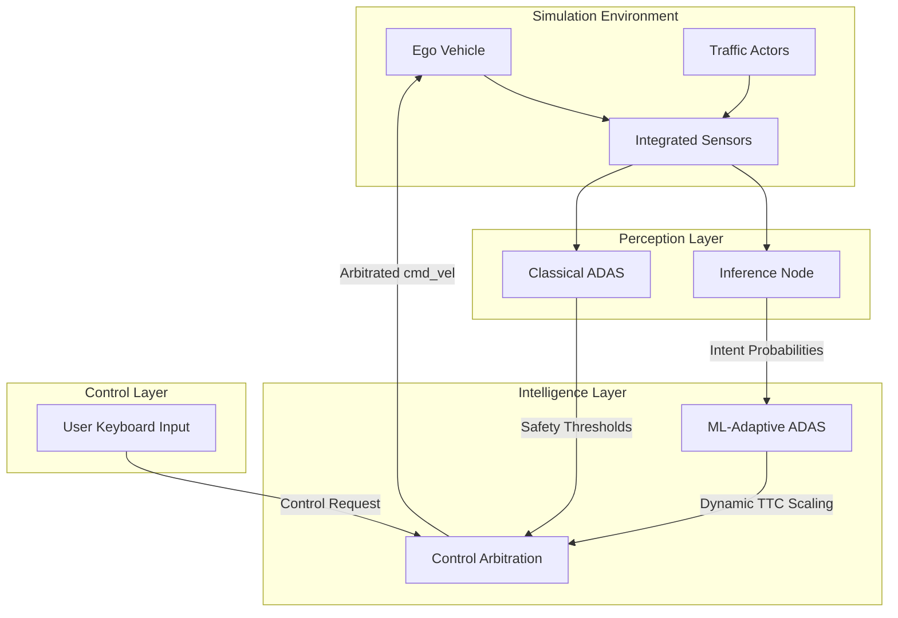

# Adaptive Intent-Aware ADAS (Advanced Driver Assistance System)

[](https://docs.ros.org/en/humble/index.html)
[](https://gazebosim.org/)

A research-oriented ADAS framework that merges deterministic classical safety metrics with **Deep Temporal Intent Prediction**. This system minimizes "Nuisance Alerts" by dynamically modulating safety thresholds based on real-time classification of driver behavior and surrounding traffic patterns.

---

## 🏎️ 1. Aggressive Driver Simulation

The "Aggressive Driver" project focuses on a high-performance, LiDAR-driven autonomous agent that navigate a 2-lane oval track in real-time.

### 🌟 Key Features
- **Real-Time Physics**: Simulation operates at 1.0 Real-Time Factor (RTF) for accurate physical modeling.
- **Pure LiDAR Perception**: The driver uses a 360° LiDAR array divided into sectors to detect and avoid obstacles without "cheating" via ground-truth data.
- **Dynamic Overtaking**: Aggressive behavior logic triggers lane changes when forward paths are blocked and returns to the primary lane once clear.
- **Auto-Reset Supervisor**: A dedicated supervisor node monitors the vehicle's state and automatically resets the Gazebo world if a collision or off-road event persists.
- **Dynamic Traffic**: Automatic spawning of multiple traffic vehicles to test avoidance and merging stability.

---

## 🛠️ 2. Setup and Usage

### Build the Workspace
```bash
cd ~/adas_ws
colcon build --packages-select adas_project
source install/setup.bash
```

### Launch the Aggressive Simulation
To start the full pipeline (Gazebo, Aggressive Driver, Traffic, and Supervisor):
```bash
ros2 launch adas_project aggressive_sim.launch.py
```

### Manual Controls & Visualization
- **RViz Visualization**: `ros2 run rviz2 rviz2 -d src/adas_project/rviz/lidar_view.rviz`
- **Telemetry Monitor**: `ros2 topic echo /driver_telemetry`

---

## 📂 3. File Descriptions

| File Path | Purpose |
| :--- | :--- |
| **`launch/aggressive_sim.launch.py`** | Unified launcher for the entire aggressive driver pipeline. |
| **`scripts/behavior_generator.py`** | Core driver logic using LiDAR sector mapping for lane-keeping and avoidance. |
| **`scripts/supervisor.py`** | Monitoring node that handles automatic `/reset_world` on collisions. |
| **`scripts/scenario_controller.py`** | Orchestrates the spawning and placement of traffic vehicles. |
| **`urdf/vehicle.xacro`** | Vehicle model with a raised LiDAR mount to prevent self-scanning interference. |
| **`worlds/two_lane.world`** | Gazebo world file tuned for 1.0 RTF simulation. |
| **`scripts/fixed_adas.py`** | Classical threshold-based ADAS implementation for comparison. |
| **`scripts/ml_adas.py`** | Neural-network-enhanced ADAS logic (Inference-driven). |

---

## 🧠 4. System Architecture

The project is built on a modular **ROS2 Humble** backend, designed for high-frequency control (20Hz) and real-time deep learning inference (10Hz).



---
**Maintained by Aarish Patel — ADAS Minor Project.**
