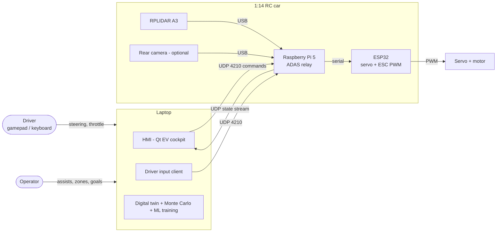
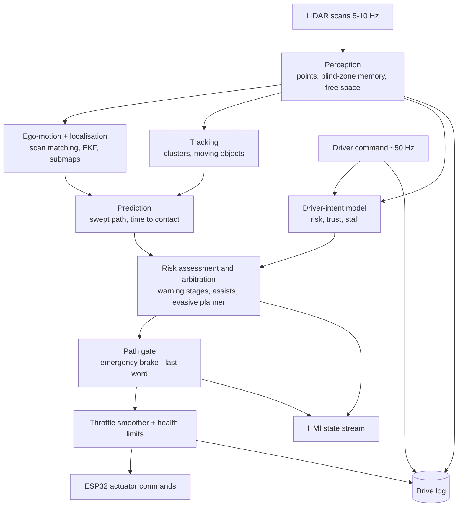
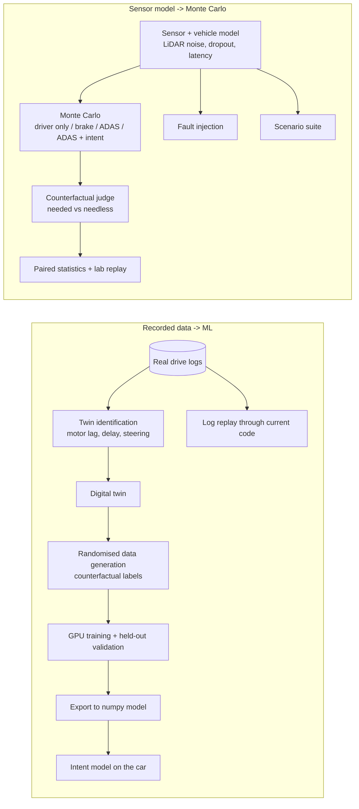
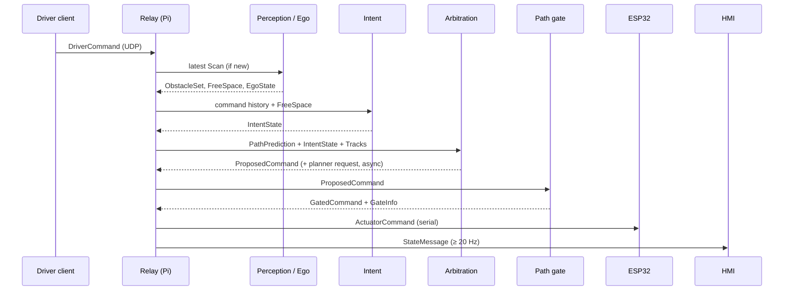
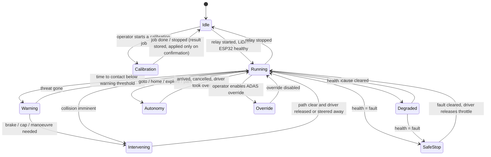
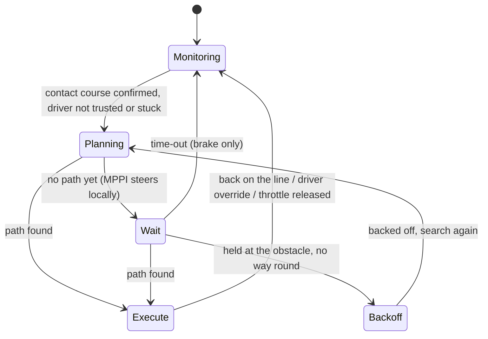

# Minimal Sensor ADAS - System Architecture Document (SAD)

| | |
|---|---|
| Document | SAD-ADAS-001 |
| Version | 1.0 |
| Date | 29 September 2026 |
| Governs | the structure, interfaces and runtime behaviour of the system specified in `docs/requirements.md` (SRS-ADAS-001) |
| Related | `docs/RESEARCH.md` (method choices and references), `docs/REPORT.md` (results), `docs/STATUS.md` (what runs on the car) |

Requirement IDs (FR-xxx, NFR-xx) refer to the SRS. This document describes *structure and interfaces*, not code.

---

## 1. Overall Architecture

### 1.1 Architectural principles

| # | Principle | Consequence |
|---|---|---|
| P1 | **One code path for car and simulation** | The digital twin, the Monte Carlo and log replay instantiate exactly the modules the car runs; only the sensor and actuator adapters differ. |
| P2 | **Hardware-free core** | The algorithm layer (`adas/`) imports no drivers, no simulator, no GUI. |
| P3 | **Physics has the last word** | The path gate (emergency brake) runs after every other decision and cannot be disabled by the learned model (NFR-16). |
| P4 | **Learned components may only withhold** | ML can hold back a steering takeover or change what is displayed; it never commands the actuators directly (FR-013). |
| P5 | **Heavy work off the control loop** | Planning, loop closure and vision run in worker threads / processes with bounded budgets (NFR-06). |
| P6 | **Everything is observable** | Every decision is logged and streamed to the HMI; every published number is reproducible by a script (NFR-19). |

### 1.2 Context



### 1.3 Processing chain (runtime, on the car)



### 1.4 Offline and verification branches



---

## 2. Module Responsibilities

Each module is described independently: purpose, inputs, outputs, timing and the requirements it serves.

### 2.1 Car-side (real-time)

| Module | Responsibility | Inputs -> Outputs | Timing | SRS |
|---|---|---|---|---|
| **LiDAR driver** | Acquire full rotations, timestamp them, reject invalid returns | USB stream -> Scan | 5-10 Hz | FR-001 |
| **Perception** | Transform to the vehicle frame (mount offset, yaw), filter, keep a blind-zone obstacle memory, compute free distance along swept paths | Scan, ego-motion -> ObstacleSet, FreeSpace | per scan | FR-001-003 |
| **Ego-motion & localisation** | Speed and yaw rate from range flow fused with the throttle model (EKF); world pose from keyframed scan matching; drift correction by submaps + loop closure; online latency and uncertainty estimates | Scan, commands sent -> EgoState, Pose, LatencyEstimate | per scan / per command | FR-005-007 |
| **Tracking** | Cluster obstacles, associate across scans, estimate velocity, flag moving objects | ObstacleSet -> TrackList | per scan | FR-004 |
| **Prediction** | Predict the car's swept path at current and alternative steering, compute time and distance to contact, stopping distance, RSS distance | EgoState, ObstacleSet, driver command -> PathPrediction | per packet | FR-010, FR-015 |
| **Driver-intent model** | Estimate the driver's risk and whether to trust them; learn their reaction profile; detect a stuck car; recalibrate the shown risk online | Driver command history, FreeSpace, EgoState -> IntentState | 20 Hz | FR-011-014, FR-016 |
| **Risk assessment & arbitration** | Choose the least intrusive response: warning, zone / drive-mode cap, steering envelope, nudge, centring, moving-object action, evasive manoeuvre, autonomy leg | PathPrediction, IntentState, TrackList, Zones -> ProposedCommand, Warnings | per packet | FR-020, 022-027, 030-034 |
| **Planner service** | Hybrid A* / Dubins path search, MPPI fallback, exploration and parking goals, off the control loop with a time budget | Planning request -> Path | on request, ≤ 0.5 s typical | FR-023, 030-033, NFR-07 |
| **Path gate** | Final safety check of the proposed command: brake, hold or cap by stopping distance; widen margins by latency and speed uncertainty | ProposedCommand, FreeSpace, EgoState -> GatedCommand, GateInfo | per packet | FR-021, NFR-16 |
| **Throttle smoother & drivetrain protection** | Rate-limit comfort changes, reverse lockout; safety cuts bypass it | GatedCommand -> ActuatorCommand | per packet | NFR-15 |
| **Health monitor** | Classify normal / limp / fault from LiDAR rate, link rate, loop time, ESP32 state, temperature; apply the degraded-mode limits | Rates, temperatures, link status -> HealthState | 1 Hz | NFR-14 |
| **ESP32 link** | Supervised serial link: commands, PING, reboot detection, re-open | ActuatorCommand -> serial frames | per packet | NFR-13 |
| **ESP32 firmware** | Generate servo and ESC PWM; stop the motor if no valid command for 500 ms | serial frames -> PWM | 50 Hz | NFR-13 |
| **Drive logger** | Record inputs, decisions and outputs for replay and training | all of the above -> DriveLog | per packet / scan | FR-042 |
| **State publisher** | Stream a compact system state to subscribed HMIs | all states -> StateMessage | ≥ 20 Hz | FR-041 |
| **Control panel service** | Start drive / calibration jobs, show and apply calibration results | HTTP requests -> jobs, results | on request | FR-048 |
| **Rear-camera service (optional)** | Visual odometry, looming objects, image quality, guidelines, ghost car; MJPEG + state | Frames -> annotated stream, CameraState | 15 FPS | FR-008 |

### 2.2 Laptop-side

| Module | Responsibility | SRS |
|---|---|---|
| **Driver input client** | Read gamepad / keyboard, send driver commands | - |
| **HMI (EV cockpit)** | Speed cluster, driver risk, safety status, 3D scene, mini-map; drawers for map & zones, assists, car setup, rear camera, diagnostics, events; dark / light themes | FR-040, 041 |
| **Monte Carlo lab / ML training lab** | Run and replay validation and training; show systems and twin cars moving in 3D | FR-045, 047 |
| **Digital twin** | Vehicle and LiDAR simulation with fitted dynamics and domain randomisation, driving the car's own modules | FR-044 |
| **Validation tools** | Scenario suite, repeatability, fault injection, Monte Carlo, log replay, evaluations | FR-043, 045, 046 |
| **ML pipeline** | Data generation, training (GPU), calibration, export, ablations | FR-047 |

---

## 3. Data Flow

### 3.1 Data objects

| Object | Producer -> Consumers | Content | Frame / units | Rate |
|---|---|---|---|---|
| **Scan** | LiDAR driver -> Perception, Ego-motion, Logger | list of (angle, range) with a sequence number and timestamp | LiDAR frame, degrees clockwise from ahead, metres | 5-10 Hz |
| **DriverCommand** | Input client -> relay | servo angle, throttle PWM (signed), sequence | servo degrees (centre ≈ 87), PWM −255..255 | ~50 Hz |
| **ObstacleSet** | Perception -> Prediction, Planner, Tracking | points in the vehicle frame incl. remembered blind-zone points | vehicle frame, m | per scan |
| **FreeSpace** | Perception -> Prediction, Intent, Gate | free distance along candidate arcs, forward / reverse | m | per scan |
| **EgoState** | Ego-motion -> all | speed, yaw rate, their uncertainties, world pose, corrected pose | m/s, rad/s, world frame | per scan / packet |
| **LatencyEstimate** | Ego-motion -> Gate | estimated scan delay and its excess over the budget | s | per scan |
| **TrackList** | Tracking -> Arbitration (moving objects) | id, position, velocity, moving flag, age | vehicle frame | per scan |
| **PathPrediction** | Prediction -> Arbitration, Gate, HMI | predicted swept path, contact point, distance and time to contact, stopping and RSS distances | vehicle frame | per packet |
| **IntentState** | Intent model -> Arbitration, Gate, HMI | risk (model + shown/recalibrated), trust flag, attentive, stalled, reaction profile | probabilities 0-1 | 20 Hz |
| **Zones** | HMI -> relay -> Arbitration | shapes (rect / circle / polygon) with km/h limits | world frame, full-size km/h | on change |
| **Path** | Planner -> Arbitration, Gate, HMI | poses with direction per point (forward / reverse legs) | start frame of the manoeuvre | on request |
| **ProposedCommand** | Arbitration -> Gate | servo, throttle, reason (assist / manoeuvre / autonomy) | servo °, PWM | per packet |
| **GatedCommand / GateInfo** | Gate -> Smoother, HMI, Logger | command after the safety check; action (pass / limited / braking / holding) and free distance | servo °, PWM, m | per packet |
| **ActuatorCommand** | Smoother -> ESP32 link | "steer" and "motor" frames | servo °, PWM | per packet |
| **HealthState** | Health monitor -> all, HMI | normal / limp / fault with causes; LiDAR Hz, link Hz, loop time, temperature | - | 1 Hz |
| **StateMessage** | State publisher -> HMI | JSON: drive, gate, plan, nav, assist, intent, world, health, esp32, points (decimated) | mixed, documented per key | ≥ 20 Hz |
| **DriveLog** | Logger -> Replay, Training | per-packet and per-scan records (compressed JSONL) | as above | continuous |
| **CameraState** | Rear camera -> HMI | fps, odometry, objects with time to contact, image quality | - | 2 Hz |

### 3.2 Sequence of one control cycle



---

## 4. Folder Structure

```
src/adas_project/
├── adas/            Algorithm core, hardware-free: geometry, braking, assists, planners (Hybrid A*, Dubins, MPPI),
│   │                crossing, intent model, tracking, EKF, latency, RSS, conformal, calibration, submaps, explore, park
│   └── vision/      Rear-camera algorithms: visual odometry, looming objects, quality, fusion, guidelines, detector
├── pi/              Car-side services: relay (main loop), assists glue, path gate, health, ESP32 link, zones,
│   │                control panel, rear-camera service, calibration jobs, systemd units, tuning files, deployed models
│   └── legacy/      Early bring-up experiments and old diagnostic reports (not used at runtime)
├── gui/             HMI: design system, controls, EV window and drawers, Monte Carlo and training labs
├── sim/             Digital twin (vehicle, LiDAR, worlds, drivers), scenario suite, Monte Carlo, evaluations, ML training
├── tools/           Utilities: log pulling / replay / streaming, camera calibration, benchmarks, twin launcher
├── tests/           Automated tests (unit, integration on the twin, GUI smoke)
├── models/          Trained models and evaluation results (JSON); large binaries excluded
├── reports/         Generated figures and HTML reports
├── web/             Browser 3D viewer (first simulator) and its vendored libraries
├── ESP32_RC/        ESP32 firmware
├── docs/            requirements.md, architecture.md, RESEARCH.md, REPORT.md, STATUS.md, TODO.md
├── rc_controller.py Driver input client (gamepad / keyboard)
├── server.py        Server for the browser viewer
└── requirements.txt Python dependencies (core, GUI, vision, optional)
```

Dependency rule: `adas` ← `pi` ← `sim`/`tools`; `gui` depends on `adas` (geometry, rendering helpers) and talks to `pi` only
over the network interfaces of § 5. Nothing depends on `sim`, `tools`, `gui` or `tests` at runtime on the car.

---

## 5. Communication Interfaces

### 5.1 Process and network interfaces

| Interface | Transport | Direction | Payload | Rate / timeout |
|---|---|---|---|---|
| Driver command | UDP, port 4210 | client -> relay | text lines: steering and motor command | ~50 Hz; relay stops the motor if commands stop |
| Operator commands | UDP, port 4210 | HMI -> relay | text commands: assist on/off, mode, zones (JSON), origin, goto (x, y, heading), home, explore, park, override, subscribe | on demand, "OK" reply |
| State stream | UDP push to subscribers | relay -> HMI | StateMessage JSON | ≥ 20 Hz; subscription renewed every 2 s, expires after 6 s |
| State pull / web view | HTTP, port 8090 | relay -> browser | StateMessage JSON, dashboard page | on request |
| Control panel | HTTP, port 8080 | HMI -> Pi | JSON: state, start job, stop, apply calibration | on request |
| Rear camera | HTTP, port 8091 | camera service -> HMI | MJPEG stream; JSON state | 15 FPS / 2 Hz |
| Actuators | USB serial | relay -> ESP32 | steer and motor frames, PING | per packet; firmware failsafe 500 ms |
| LiDAR | USB serial (native streamer) | sensor -> relay | scan frames | 5-10 Hz |

### 5.2 Python interfaces (module boundaries)

Described by responsibility; signatures live in the code.

| Class / service | Provides | Used by |
|---|---|---|
| RelayAssists | processes one packet of driver lines + current scan into rewritten actuator lines; goto / home / explore / park; drive mode; zones | relay, twin, Monte Carlo, replay |
| PathGate | free distance along a path; decision (pass / cap / brake / hold) for a proposed command | relay, twin, Monte Carlo, replay |
| RelaySpeed | speed, yaw rate, their uncertainty, world pose, corrected pose, latency estimate | gate, assists, intent |
| RelayIntent | risk, trust, attentive, stalled, recalibrated risk, HMI summary | assists, gate |
| DrivingAssists | evasive manoeuvre state machine, nudge, centring, limiter, narrow-gap, proximity | RelayAssists |
| PlanService | asynchronous planning jobs with budgets (inline in simulation, process on the car) | assists, autonomy |
| AutoNav / Explorer / parking | goal-directed legs, frontier exploration, bay / slot detection | RelayAssists |
| HealthMonitor / EspLink | degraded-mode classification; supervised actuator link | relay |
| SlamService | loop-closed pose correction in a worker | RelaySpeed |

### 5.3 ROS 2 mapping

The system does not use ROS today (a single relay process meets the latency budget with less overhead on the Pi). The interfaces are
defined so that each maps 1:1 onto a ROS 2 topic / service if the stack is ported:

| Data object | ROS 2 topic | Message type |
|---|---|---|
| Scan | /scan | sensor_msgs/LaserScan |
| DriverCommand | /driver/cmd | ackermann_msgs/AckermannDriveStamped |
| EgoState | /odom, /tf | nav_msgs/Odometry, TF (map -> odom -> base_link -> laser) |
| TrackList | /adas/tracks | custom TrackArray |
| PathPrediction / Path | /adas/predicted_path, /adas/plan | nav_msgs/Path |
| IntentState | /adas/intent | custom Intent (risk, trust, stalled) |
| GateInfo | /adas/gate | custom GateStatus |
| ActuatorCommand | /cmd_ackermann | ackermann_msgs/AckermannDriveStamped |
| HealthState | /diagnostics | diagnostic_msgs/DiagnosticArray |
| Map / submaps | /map | nav_msgs/OccupancyGrid |
| Goals | /goal_pose, services explore / park / home | geometry_msgs/PoseStamped, std_srvs/Trigger |

### 5.4 Coordinate frames and units

| Frame | Origin | Axes | Used for |
|---|---|---|---|
| **LiDAR** | LiDAR centre (0.12 m ahead of the rear axle) | angle clockwise from ahead, range | raw scans |
| **Vehicle** (base_link) | rear-axle centre | x ahead, y left, θ counter-clockwise | perception, prediction, gate, planning |
| **World** (odom / map) | pose at start or last origin reset | x, y, θ | map, zones, return to start, exploration |
| **Manoeuvre start** | pose when a plan began | as vehicle | planned paths and tracking of a manoeuvre |
| **Camera** | rear camera optical centre | pinhole, yaw 180° (rear-facing) | vision, projection onto the floor |

Units: SI throughout (m, s, rad internally; degrees only at interfaces and in the HMI). Speed in the HMI is shown as
full-size km/h = car m/s × 14 × 3.6. Servo angle in degrees (centre ≈ 87, + = right at the servo); throttle PWM −255..255 (+ = forward
after the motor-direction correction). Curvature + = left.

---

## 6. State Machines

### 6.1 System (relay) state



**Logging** is not a state but an orthogonal activity: it runs in every state except Idle, so that calibrations, interventions and
faults are always recorded.

| State | Actuators | HMI headline |
|---|---|---|
| Idle | motor zero | NO DATA / CONNECTING |
| Calibration | driven by the job | job name, instructions |
| Running | driver's command, assists active | GUARDIAN / path clear |
| Warning | driver's command | COLLISION WARNING (amber) |
| Intervening | gated / planned command | EMERGENCY BRAKE (red) or AUTONOMOUS MANOEUVRE |
| Degraded | throttle capped (limp) | LIMP with cause |
| SafeStop | motor zero | FAULT with cause |
| Autonomy | planned command, operator holds throttle | AUTONOMY + goal |
| Override | driver's command, no assists | OVERRIDE - NO ADAS (red) |

### 6.2 Evasive manoeuvre



---

## 7. Error Handling

### 7.1 Fault matrix

| Fault | Detection | Immediate reaction | Degraded mode | Recovery |
|---|---|---|---|---|
| **LiDAR stops** (USB stall, unplugged) | no new scan for 0.5 s; health: scan rate | throttle to zero (gate) | fault -> SafeStop | scans resume, driver releases throttle |
| **LiDAR slow** | scan rate below threshold over a window | - | limp: throttle capped | rate recovers |
| **Invalid scan** (too few points, all invalid, out of range) | point count / range checks per scan | scan discarded, previous obstacle memory kept, ego-motion falls back to the model | - | next valid scan |
| **Frozen scan** (same data repeated) | sequence number unchanged | treated as no new scan; memory advanced by dead reckoning | as LiDAR stops if it persists | new sequence |
| **Late scans** (latency) | online delay estimate from speed mismatch | stopping margin widened by speed × excess | - | estimate decays |
| **Spurious points** (dust, reflections) | isolated returns; tracking consistency | conservative: braked for if on the path; not tracked as moving | - | - |
| **Scan-match failure** | residual / inlier checks, EKF innovation gate | prediction used for that step; uncertainty grows -> margins grow | - | next good match |
| **Dropped driver packets / WiFi loss** | packet rate; relay command timeout | motor zero when commands stop | limp when lossy | packets resume |
| **ESP32 silent / rebooted / unplugged** | PING reply, reboot banner, serial errors | relay stops sending motion; ESP32 failsafe stops the motor after 500 ms | fault | link re-opened automatically |
| **Control loop overrun** | 95th-percentile loop time | - | limp | load drops |
| **Pi over-temperature** | temperature reading | - | limp | cools down |
| **Planner time-out / no path** | job budget | brake only, retry, back off (max 3) | - | new plan |
| **Car stuck** | no progress with the throttle held | trust withdrawn, evasive allowed; autonomy re-plans, then gives up | - | progress resumes |
| **HMI link lost** | no state for 2.5 s | HMI shows NO DATA; car unaffected | - | automatic re-subscribe |
| **Camera missing / degraded** | stream / quality checks | camera functions off, designed empty state | - | camera back |

### 7.2 Handling rules

1. **Fail safe, not fail silent:** every fault either stops the motor, caps it, or is shown; none is ignored.
2. **Independent last line:** the ESP32 firmware stops the motor on its own if the Pi fails.
3. **No learned component in the fault path:** detection and reaction are rule-based and tested with fault injection (FR-046).
4. **Every fault is logged** with time, cause and state for replay.

---

## 8. Future Expansion

The perception layer produces sensor-independent objects (ObstacleSet, FreeSpace, TrackList) in the vehicle frame, so new sensors
are added as producers without changing prediction, arbitration or the gate.

| Sensor / capability | Adds | Integration point | Architectural impact |
|---|---|---|---|
| **Front camera** | classification (person, car), lane / markings, traffic signs, better intent (driver gaze if interior camera) | object-level fusion with LiDAR tracks (late fusion already used for the rear camera) | classification field on tracks; camera-to-vehicle calibration |
| **Radar** (mm-wave) | direct radial velocity, robustness to dust / low light, glass and black surfaces | TrackList (velocity), FreeSpace (range) | per-sensor confidence in the fusion; timestamp alignment |
| **Ultrasonic ring** | close-range blind-zone coverage for parking | ObstacleSet near the body | replaces part of the blind-zone memory |
| **Wheel encoders / IMU** | speed and yaw independent of the LiDAR | EgoState fusion (EKF) | redundant ego-motion, better during scan-match failures |
| **GPS / GNSS** | outdoor absolute position | World frame anchoring, loop-closure prior | map in a geodetic frame |
| **V2X** | other vehicles' intent and position, infrastructure (signals, speed limits) | TrackList (cooperative objects), Zones | message receiver and trust / plausibility checks |
| **ROS 2 port** | standard tooling (rosbag, RViz, Nav2) | § 5.3 mapping | relay split into nodes; same algorithms |
| **Cloud / fleet learning** | retraining from many drivers' logs | ML pipeline (logs -> twin identification -> training) | log upload, model versioning and rollback |
| **Functional safety** | ISO 26262 / SOTIF style evidence | hazard analysis linked to SRS IDs | safety case, independent monitor |

---

## 9. Traceability summary

| Architectural element | Requirements |
|---|---|
| Perception, ego-motion, tracking | FR-001-008, NFR-01-03, NFR-11-12 |
| Prediction, intent, arbitration, gate | FR-010-027, NFR-15-16 |
| Planner service, autonomy | FR-023, FR-030-034, NFR-06-07 |
| Health, ESP32 link, firmware | NFR-08, NFR-13-14, § 7 |
| Logger, replay, twin, Monte Carlo, ML pipeline | FR-042-048, NFR-18-19 |
| HMI | FR-040-041, NFR-04, NFR-20 |

## 10. Change Control

| Version | Date | Change |
|---|---|---|
| 1.0 | 29 Sep 2026 | First baseline (replaces the earlier short architecture note) |
